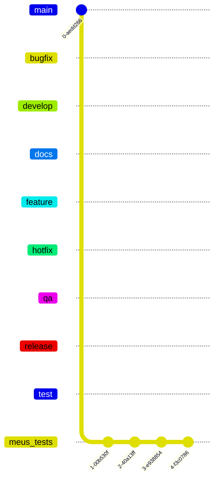
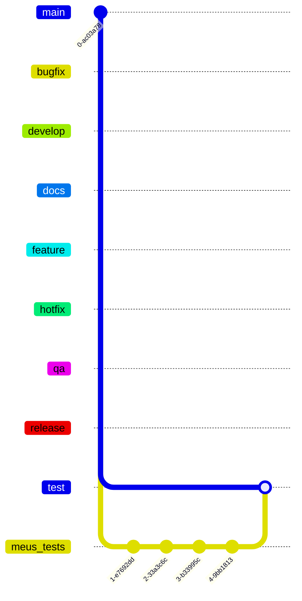

# <i>Contributing</i> | Sumário - Overview

> [!NOTE]
> Ao contribuir para este repositório, tente primeiro discutir a alteração que deseja fazer através de uma issue, e-mail ou qualquer outro método com a equipe.

## Processo de fork
Esse é opcional, mas pode ser que sirva.
1. Se você ainda não fez o fork do projeto, [clique aqui](https://github.com/timeway/timeway/fork)
2. Quando chegar na tela onde cria o fork, desmarque a opção que está destacada na imagem abaixo:

3. Após isso, clique no botão <i>"Create fork"</i>

## Workflow
Em primeiro lugar, aqui está o que você deve fazer assim que estiver com o repositório local na sua máquina
1. Atualizar o repositório local e mudar de branch:

> Se você está usando o git, aqui vai os comandos que deve fazer se for leigo:
```shell
git fetch --all
git checkout -b <nome-da-branch>
```

> [!TIP]
> Veja as branchs que já existem no repositório pelo link -> https://github.com/timeway/timeway/branches

> Se desejar linkar a branch do seu repositório local para a branch do repositório remoto, faça o passo-a-passo a seguir:
```shell
git branch -u origin/<branch-remoto> <branch-local>
# Ex: git branch -u origin/develop develop
```

> Isso vai lhe ajudar a fazer pull na sua branch local e se atualizar

2. Após ter mudado de branch, você faz as modificações necessárias
```shell
git add <file>
git commit -m "atualiza a cena"
```

3. Agora, supondo que você esteja em uma branch que não é compartilhada (Ex: `develop`, `main`, etc) - e que você fez aquele commit nessa suposta branch, você deve priorizar o seguinte flow:



> É assim que você seu fluxo está agora, mas continuando: <br>
> Vamos supor que você acha que esses testes deram todos certos e você quer finalmente contribuir <br> Fazer uma modificação no README.md é opcional, eu até não recomendo <br> Tente destacar as novidades e/ou melhorias no Pull Request

> [!IMPORTANT]
> Os Pull Requests devem ser abertos e direcionados apenas para a branch **TEST** <br>
> Do contrário, vai quebrar toda a estrutura do **Workflow**

> Assim que o Pull Request for aceito, o Workflow vai ficar desse jeito:



## Precesso de Pull Request
1. Aumente os números de versão em todos os arquivos de exemplo e no README.md para a nova versão que este Pull Request representa. O esquema de versionamento que usamos é o <i>[SemVer](https://semver.org/ "SemVer")</i>
2. Você pode mesclar a solicitação de Pull Request assim que tiver a aprovação de dois desenvolvedores ou, caso não tenha permissão para isso, pode solicitar que o revisor a mescle para você